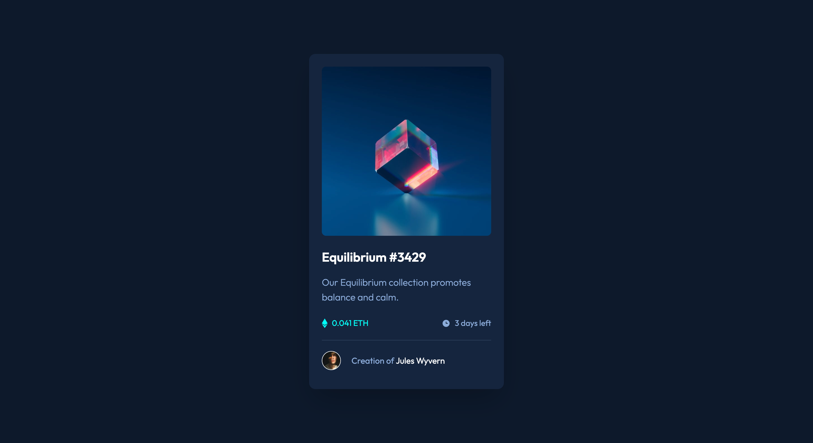

# Frontend Mentor - NFT preview card component solution

This is a solution to the [NFT preview card component challenge on Frontend Mentor](https://www.frontendmentor.io/challenges/nft-preview-card-component-SbdUL_w0U). Frontend Mentor challenges help you improve your coding skills by building realistic projects. 

## Table of contents

- [Overview](#overview)
  - [The challenge](#the-challenge)
  - [Screenshot](#screenshot)
  - [Links](#links)
- [My process](#my-process)
  - [Built with](#built-with)
  - [What I learned](#what-i-learned)
- [Author](#author)

## Overview

### The challenge

Users should be able to:

- View the optimal layout depending on their device's screen size
- See hover states for interactive elements

### Screenshot

### Links

- Solution URL: [View repo](https://github.com/VeyronShark/FrontendMentor-NFT-Preview-Card)
- Live Site URL: [View site](https://veyronshark.github.io/FrontendMentor-NFT-Preview-Card/)

## My process

### Built with

- Semantic HTML5 markup
- Flexbox
- Mobile-first workflow
- [TailwindCSS](https://tailwindcss.com/) - CSS Framework

### What I learned

Since this was a relatively small project, I focused more on time management and how good I am at estimated how much I take to do things. I kept trying to predict how much time I would take to complete various tiny tasks and major tasks.

## Author

- Frontend Mentor - [@VeyronShark](https://www.frontendmentor.io/profile/VeyronShark)
- GitHub - [@VeyronShark](https://github.com/VeyronShark)